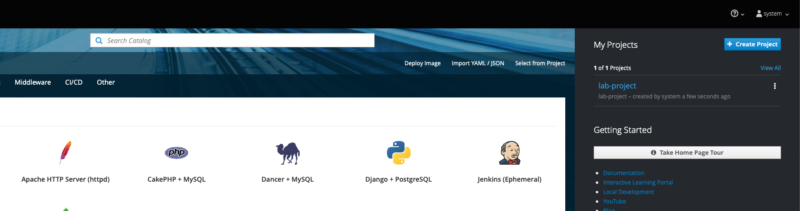
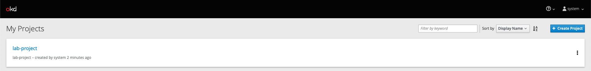
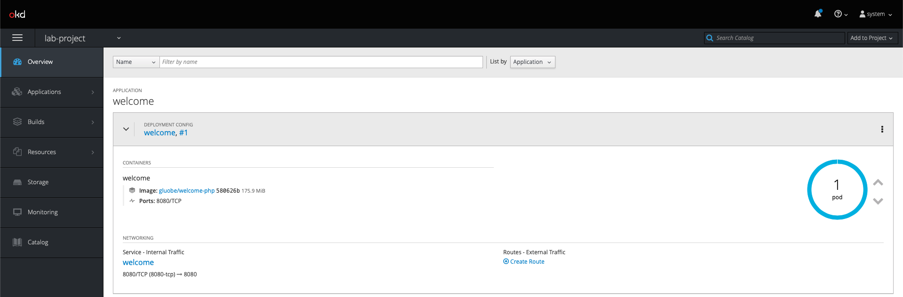
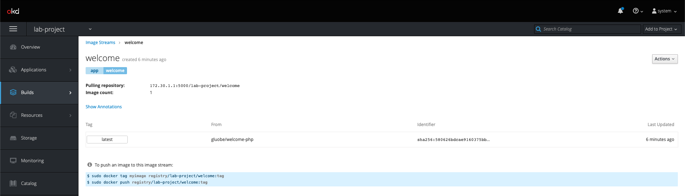
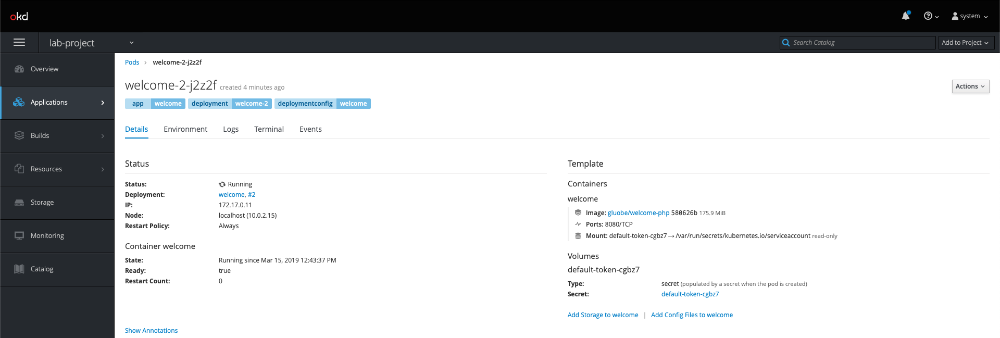
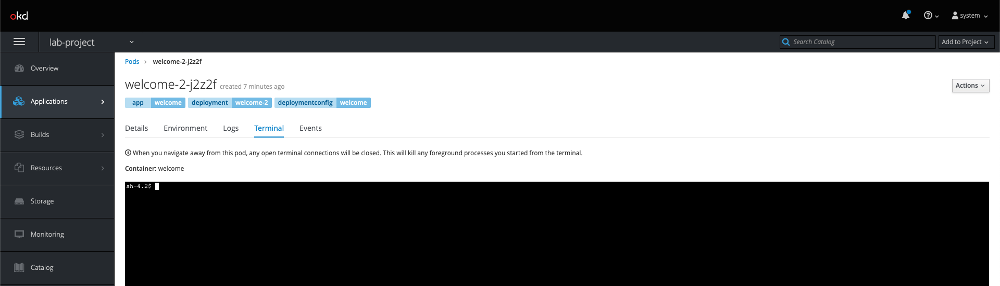
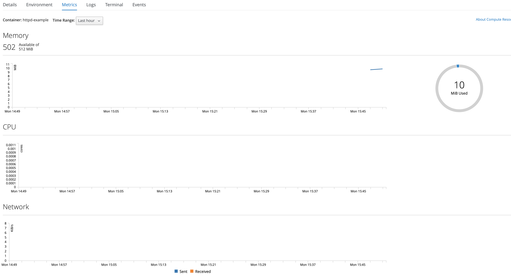

# Lab 03 - Using the web console

In this lab we will explore the Openshift Web Console.

## Task 1: Login to the web console

Type in the master public URL provided by your instructor in a browser. Use
<master public URL>:<port>. You will be directed to an OpenShift login page.

Login with the `username` and `password` provided by the instructor. You will now see the Service Catalog. Your created project will be listed on the right.

Click on "View All" on the right. You will see the list of projects now.

Also note the `Create Project` button which allows you to create a new
project from Web Console.

Create a project `lab-03-<USERNAME>`.

Now click on the CLI Project to view the details. OpenShift takes you by
default to the `Overview` page and shows you a graphic representation of
the application that is deployed here. You will also see the `Add to
Project` button on the top. This can be used to create new application
from Web Console inside this project.

Create an application of your choice, if you create a `PHP` application you can 
use `https://github.com/gluobe/container-info` as a source repository.

Select `Images` under `Builds` tab, you will see all the images in the project. Click onto the image to see the details.

Select `Pods` under `Applications` tab, you will find a running pod that
is running your application image. Note that it also tells you the node
on which the pod is running and other details about this pod. You will
also see the build pod that had succeeded.

Click onto running pod, it shows the details on the pod. In addition,
metrics, logs and terminal also available for monitoring.

Click on `Terminal` tab, you will be able to access the pod from web
console.

When navigating to `Applications``Pods` you are able to check the metrics for the
pod you have selected in the `Metrics` tab.

Click `Builds` on left menu and select `Builds`. Select the build name
`time` and then click on `Configuration` tab. Note there are webhook
URLs. We will use them in a later lab exercise. You can start a build
from the Web Console by pressing the `Start Build` button in the right
top corner. It also gives you a command to start the build from CLI.

* Select `Services` under `Applications` tab, you will find the service
created for your application. Click onto one of the services, it shows
all the details about the service along with the option to expose it as
a route.
* Select `Routes` under `Applications` tab, you will see all the routes
in the project. Click onto a route, it shows all the details for this
route.
* Select `Deployments` under `Applications` tab, you will see all the
deployments. Click onto a deployment, it shows all the details of the
deployment. By pressing the `Deploy` button, you will be able to start a
deployment from the web console.

## Task 2: Delete your project

You are also able to delete the project via the `Web Console`. On the upper left
press the name of your project and click on `View All Projects`. On the right
side of your projectname you can see 3 dots, click on the `3 dots` and select
`Delete Project`.