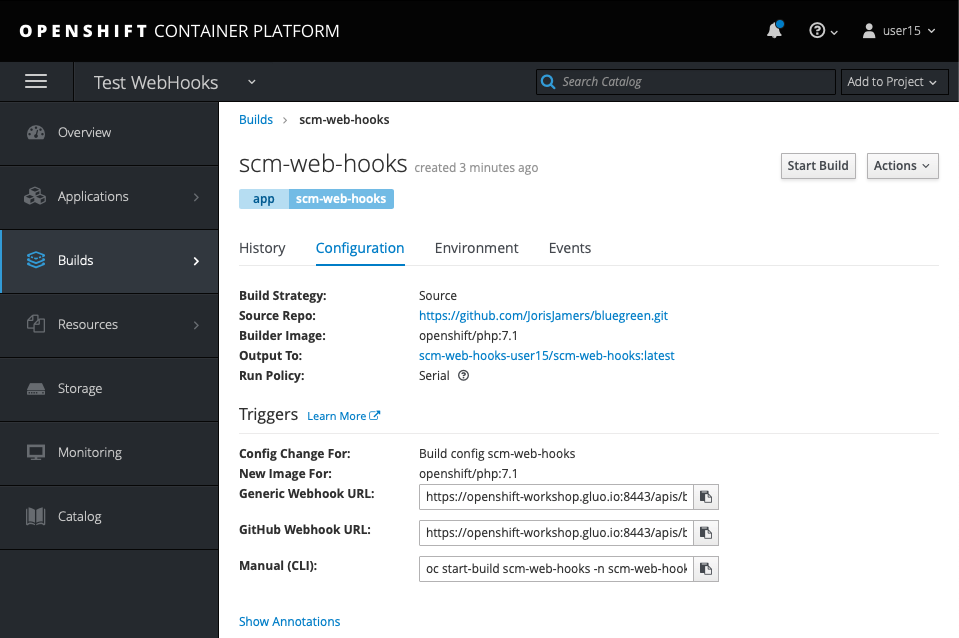
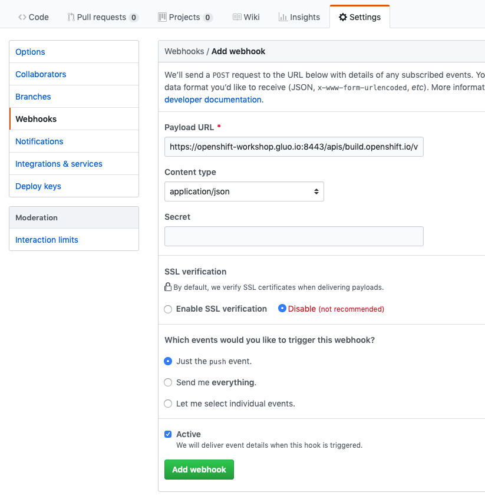

# Lab - 08 SCM Web Hooks

It's possible to trigger a deployment of an application in various ways. In this
lab we will demonstrate the deployment of an application via a GitHub Web Hook
trigger.

## Task 1: Create a project

Export the username environment variable. This to be sure that you are going to
create the correct objects.

```
export USERNAME=<username>
```

For this lab we are going to create fresh project. Use the following command.

```
oc new-project lab-08-${USERNAME}
```

Or, of course, create the `lab-08-${USERNAME}` project through the UI.

## Task 2: Create a new application

We will use a forked repository from the application used in the previous lab.
Browse to GitHub and fork the following repository 
https://github.com/RedHatWorkshops/bluegreen.

> NOTE: make sure you replace `<GITHUB_USERNAME>` below with your actual GitHub 
> username!

```
oc new-app --image-stream=php --code=https://github.com/<GITHUB_USERNAME>/bluegreen.git --name=scm-web-hooks

--> Found image 4757d9f (13 days old) in image stream "openshift/php" under tag "7.1" for "php"

    Apache 2.4 with PHP 7.1
    -----------------------
    PHP 7.1 available as container is a base platform for building and running various PHP 7.1 applications and frameworks. PHP is an HTML-embedded scripting language. PHP attempts to make it easy for developers to write dynamically generated web pages. PHP also offers built-in database integration for several commercial and non-commercial database management systems, so writing a database-enabled webpage with PHP is fairly simple. The most common use of PHP coding is probably as a replacement for CGI scripts.

    Tags: builder, php, php71, rh-php71

    * The source repository appears to match: php
    * A source build using source code from https://github.com/trescst/bluegreen.git will be created
      * The resulting image will be pushed to image stream tag "scm-web-hooks:latest"
      * Use 'start-build' to trigger a new build
    * This image will be deployed in deployment config "scm-web-hooks"
    * Ports 8080/tcp, 8443/tcp will be load balanced by service "scm-web-hooks"
      * Other containers can access this service through the hostname "scm-web-hooks"

--> Creating resources ...
    imagestream.image.openshift.io "scm-web-hooks" created
    buildconfig.build.openshift.io "scm-web-hooks" created
    deploymentconfig.apps.openshift.io "scm-web-hooks" created
    service "scm-web-hooks" created
--> Success
    Build scheduled, use 'oc logs -f bc/scm-web-hooks' to track its progress.
    Application is not exposed. You can expose services to the outside world by executing one or more of the commands below:
     'oc expose svc/scm-web-hooks'
    Run 'oc status' to view your app.
```

## Task 3: Look at some of the created resources

Check out the build configuration.

```
oc get bc

NAME            TYPE      FROM      LATEST
scm-web-hooks   Source    Git       1
```

Check out the deployment configuration.

```
oc get dc

NAME            REVISION   DESIRED   CURRENT   TRIGGERED BY
scm-web-hooks   1          1         1         config,image(scm-web-hooks:latest)
```

Show the created service.

```
oc get service

NAME            TYPE        CLUSTER-IP     EXTERNAL-IP   PORT(S)             AGE
scm-web-hooks   ClusterIP   172.30.118.0   <none>        8080/TCP,8443/TCP   42s
```

Show the replication controller.

```
oc get rc

NAME              DESIRED   CURRENT   READY     AGE
scm-web-hooks-1   1         1         1         29s
```

Show the route you have created.

```
oc get route

No resources found.
```

You will see that there is no route created yet for this application. This is
something we will do in the following steps of the lab.

Follow the build logs, this could be in progress with a status `Running` or 
complete with the status `Complete`. When the build is complete you will find 
the following output in the logs.

```
oc logs build/scm-web-hooks-1 -f

Pushing image 172.30.1.1:5000/scm-web-hooks-joris/scm-web-hooks:latest ...
Pushed 0/10 layers, 7% complete
Pushed 1/10 layers, 19% complete
Pushed 2/10 layers, 25% complete
Pushed 3/10 layers, 32% complete
Pushed 4/10 layers, 41% complete
Pushed 5/10 layers, 53% complete
Pushed 6/10 layers, 63% complete
Pushed 7/10 layers, 81% complete
Pushed 8/10 layers, 84% complete
Pushed 9/10 layers, 99% complete
Pushed 10/10 layers, 100% complete
Push successful
```

Now we are going to create a route for the application:

```
oc get service

NAME            TYPE        CLUSTER-IP     EXTERNAL-IP   PORT(S)             AGE
scm-web-hooks   ClusterIP   172.30.118.0   <none>        8080/TCP,8443/TCP   2m
```

Create the actual route:

```
oc expose service scm-web-hooks

route.route.openshift.io/scm-web-hooks exposed
```

Now test the application:

```
oc get route

NAME            HOST/PORT                                                     PATH      SERVICES        PORT       TERMINATION   WILDCARD
scm-web-hooks   scm-web-hooks-lab-08-<USERNAME>.apps.openshift-workshop.gluo.io             scm-web-hooks   8080-tcp                 None
```

Past the `HOST/PORT` section in your browser. This will get you to your 
deployment: http://scm-web-hooks-lab-08-<USERNAME>.apps.openshift-workshop.gluo.io

## Task 4: Configure the github webhook

After the above steps we have a working application, we are now going to 
configure a webhook that triggers a rebuild and redeploy of our application when 
our code on GitHub changes.

* Navigate to the OpenShift Web console and login.
* Select your `lab-08-<USERNAME>` project, and click `Builds` and then `Builds`.
* Click onto the build name from the list. You should have just one in this 
case.
* Click `Configuration` tab to get list of `Triggers` for the GitHub link.
* Copy the `GitHub webhook URL`. You will need this URL for next step.



* Login to your GitHub account.
* Navigate to the forked repository you used to create the application.
* Click on Settings.
* Click on Webhooks.
* Click on the `Add webhook` button.
* Add the recently copied Web Hook URL from OpenShift.
* Change the Content-type as `application/json`
* Click on the `Disable SSL Verification` button.
* Confirm by adding the `Add Webhook` button in green at the bottom of the page.




* Edit in your GitHub account the `image.php` file.
* There are a number of things you could change, but we are going to change the
color to a static color. Remove the following lines and add the new line.

Delete the section below entirely :

```
if ( $deployment == 'blue') {
  $color = imagecolorallocate($im, 0, 255, 0);
} elseif ($deployment == 'green')  {
  $color = imagecolorallocate($im, 0, 255, 0);
} else {
  $color = imagecolorallocate($im, 0, 0, 255);
}
```

Add the code below where you just deleted the section :

```
$color = imagecolorallocate($im, 255,0,0);
```

This will staticly use the `red` color.

Commit the file to the repository, and immediatly look at your OpenShift console 
at the `Overview` page.

What you should see that as soon as you have commited your change, a new build 
is automatically triggered in OpenShift.  As soon as the build is completed, the 
image that was just built is pushed to the internal registry and as soon as the 
image is pushed a rolling update is being performed.

You can of course also follow all this through the command line using the 
following commands:

```
oc get builds

NAME              TYPE      FROM          STATUS     STARTED          DURATION
scm-web-hooks-1   Source    Git@9008f89   Complete   14 minutes ago   27s
scm-web-hooks-2   Source    Git@6e78366   Complete   2 minutes ago    15s
```
``
oc logs build/scm-web-hooks-2 -f

Cloning "https://github.com/trescst/bluegreen.git" ...
	Commit:	6e783668f964c663172290506c3c41a838488e9d (Update image.php)
	Author:	Steven Trescinski <trescst@users.noreply.github.com>
	Date:	Wed Mar 20 07:44:58 2019 +0100
Using docker-registry.default.svc:5000/openshift/php@sha256:a288c8d47cc754ac13bb0c0b1ebadc57582515a1a65e7e9782b833d95b7670c2 as the s2i builder image
---> Installing application source...
=> sourcing 20-copy-config.sh ...
---> 06:45:13     Processing additional arbitrary httpd configuration provided by s2i ...
=> sourcing 00-documentroot.conf ...
=> sourcing 50-mpm-tuning.conf ...
=> sourcing 40-ssl-certs.sh ...

Pushing image docker-registry.default.svc:5000/lab-08-user13/scm-web-hooks:latest ...
Pushed 5/6 layers, 92% complete
Pushed 6/6 layers, 100% complete
Push successful
```

*Don't delete your deployment or project at this stage, we are going to re-use 
this in the next lab.*