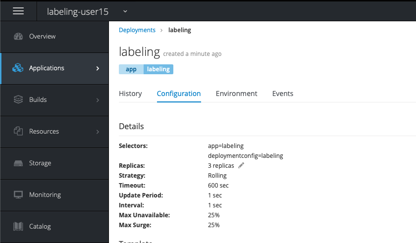

# Lab - 11 Labeling Nodes

## Task 1: Create a project

Export the username environment variable. This to be sure that you are going to
create the correct objects.

```
export USERNAME=<username>
```

For this lab we are going to create fresh project. Use the following command.

```
oc new-project lab-11-${USERNAME}
```

Or, of course, create the `lab-11-${USERNAME}` project through the UI.

## Task 2 : Create and start an application with 3 replicas

We will demonstrate node labeling with an application where we spawn 3 replicas 
of that application. First we will not label the pods. This will make the pods 
spread over our compute nodes. In the second step we will label the replicas in 
a way that they will get grouped on one compute node.

```
oc new-app --image-stream=php --code=https://github.com/RedHatWorkshops/bluegreen.git --name=labeling

--> Found image 4757d9f (13 days old) in image stream "openshift/php" under tag "7.1" for "php"

    Apache 2.4 with PHP 7.1
    -----------------------
    PHP 7.1 available as container is a base platform for building and running various PHP 7.1 applications and frameworks. PHP is an HTML-embedded scripting language. PHP attempts to make it easy for developers to write dynamically generated web pages. PHP also offers built-in database integration for several commercial and non-commercial database management systems, so writing a database-enabled webpage with PHP is fairly simple. The most common use of PHP coding is probably as a replacement for CGI scripts.

    Tags: builder, php, php71, rh-php71

    * The source repository appears to match: php
    * A source build using source code from https://github.com/RedHatWorkshops/bluegreen.git will be created
      * The resulting image will be pushed to image stream tag "labeling:latest"
      * Use 'start-build' to trigger a new build
    * This image will be deployed in deployment config "labeling"
    * Ports 8080/tcp, 8443/tcp will be load balanced by service "labeling"
      * Other containers can access this service through the hostname "labeling"

--> Creating resources ...
    imagestream.image.openshift.io "labeling" created
    buildconfig.build.openshift.io "labeling" created
    deploymentconfig.apps.openshift.io "labeling" created
    service "labeling" created
--> Success
    Build scheduled, use 'oc logs -f bc/labeling' to track its progress.
    Application is not exposed. You can expose services to the outside world by executing one or more of the commands below:
     'oc expose svc/labeling'
    Run 'oc status' to view your app.
```

Increasing replica's of deployment is easy and can done in different ways.

The first way is to simply go to the OpenShift console and click the `Scale up` 
sign (`^`).

The second way is to use the command line:

```
oc scale dc/labeling --replicas=3

deploymentconfig.apps.openshift.io/labeling scaled
```

A third way is to edit the deploymentconfig directly.  This can be done through 
the command line or the UI.

If you navigate to `Applications` `Deployments` you will see your deployment. 
Click on the deployment and navigate to `Configuration`. Like shown underneath 
you can add replicas by clicking on the pencil and just add some more replicas.



Or you can edit the `deploymentConfig`.

```
oc edit dc labeling
```

And search for and edit the following config.

```
spec:
  replicas: 1
```

Confirm that your replicas are running on different nodes.

```
oc get pods -o wide

NAME               READY     STATUS      RESTARTS   AGE       IP             NODE                                        NOMINATED NODE
labeling-1-6lxcr   1/1       Running     0          3m        10.128.8.81    compute2.openshift-workshop.gluo.internal   <none>
labeling-1-99lhb   1/1       Running     0          2m        10.128.16.80   compute3.openshift-workshop.gluo.internal   <none>
labeling-1-build   0/1       Completed   0          3m        10.128.8.80    compute2.openshift-workshop.gluo.internal   <none>
labeling-1-wpcnz   1/1       Running     0          2m        10.128.12.69   compute4.openshift-workshop.gluo.internal   <none>
```

You can see that the pods are running on compute node 2, 3 and 4. With labeling 
you could group these pods on one node.

## Task 3 : Edit the deploymentConfig

Edit the `deploymentConfig` with the following command.

```
oc edit dc labeling
```

Search for `template` in the config and add the `nodeSelector` parameter 
underneath the spec of this `template` (search for `dnsPolicy` and copy the 
following underneath):

```
      nodeSelector:
        kubernetes.io/hostname: compute2.openshift-workshop.gluo.internal
```

It should look like:

```
...
template:
    metadata:
      annotations:
        openshift.io/generated-by: OpenShiftNewApp
      creationTimestamp: null
      labels:
        app: labeling
        deploymentconfig: labeling
    spec:
      containers:
      - image: docker-registry.default.svc:5000/labeling-user15/labeling@sha256:23ca1c9e5a043cc924e45b4587322e8432c01ac6da9b7eb049dab2025007d634
        imagePullPolicy: Always
        name: labeling
        ports:
        - containerPort: 8080
          protocol: TCP
        - containerPort: 8443
          protocol: TCP
        resources: {}
        terminationMessagePath: /dev/termination-log
      dnsPolicy: ClusterFirst
      nodeSelector:
        kubernetes.io/hostname: compute2.openshift-workshop.gluo.internal
...
```

When you list your pods after the recreation you will see that all the pods are
on the same node now.

```
oc get pods -o wide

NAME               READY     STATUS      RESTARTS   AGE       IP            NODE
labeling-1-build   0/1       Completed   0          17m       10.128.8.19   compute2.openshift-workshop.gluo.internal
labeling-9-bfsnl   1/1       Running     0          2m        10.128.8.27   compute2.openshift-workshop.gluo.internal
labeling-9-bgq6k   1/1       Running     0          2m        10.128.8.26   compute2.openshift-workshop.gluo.internal
labeling-9-x8n42   1/1       Running     0          2m        10.128.8.25   compute2.openshift-workshop.gluo.internal
```

## Task 4 : Delete your project

You can delete your project in the web console or via the CLI with the following
command.

```
oc delete project lab-11-${USERNAME}
```